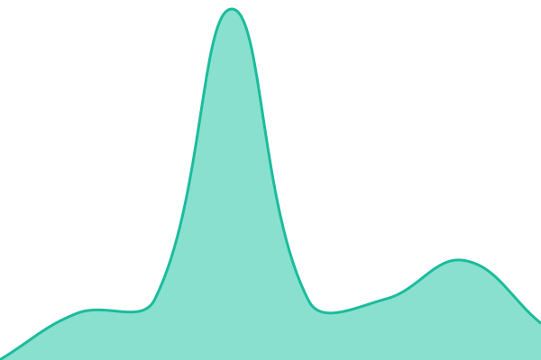

# XYZTools Status

Status público e monitoramento de disponibilidade do [XYZTools](https://xyztools.app/).

<p>
  <a href="https://status.xyztools.app/"><strong>Abrir status</strong></a>
  ·
  <a href="https://github.com/jhonsrodrigues/status.xyztools.app/actions">Ver automações</a>
</p>


## Visão geral

Este repositório combina:

- **Upptime** para monitorar o serviço, registrar histórico e gerar métricas.
- **Astro** para renderizar a página pública de status.
- **GitHub Actions** para executar as verificações e publicar o site no GitHub Pages.

A interface lê os dados gerados pelo Upptime em `history/summary.json` durante o build. Assim, o site continua estático, rápido e sem depender de um backend próprio.

## Desenvolvimento local

Requisitos: Node.js 22 ou superior.

```bash
npm install
npm run dev
```

Abra `http://localhost:4321` no navegador.

Para testar a versão de produção:

```bash
npm run build
npm run preview
```

## Estrutura

| Caminho                 | Responsabilidade                                  |
| ----------------------- | ------------------------------------------------- |
| `src/pages/index.astro` | Página pública e leitura do resumo do Upptime     |
| `src/styles/global.css` | Sistema visual, responsividade e animações        |
| `history/`              | Histórico de disponibilidade e última verificação |
| `api/`                  | Métricas de uptime e tempo de resposta            |
| `graphs/`               | Gráficos gerados pelo Upptime                     |
| `.upptimerc.yml`        | Serviços monitorados e configurações do Upptime   |
| `.github/workflows/`    | Monitoramento, atualização dos dados e deploy     |

## Fluxo de dados

1. O Upptime verifica os serviços configurados em `.upptimerc.yml`.
2. As Actions atualizam `api/`, `history/` e `graphs/`.
3. Uma alteração nesses diretórios dispara o workflow do site.
4. O Astro lê o resumo e gera `dist/`.
5. O GitHub Pages publica o conteúdo de `dist/` em `status.xyztools.app`.

## Configuração do monitoramento

Adicione ou altere serviços em [.upptimerc.yml](.upptimerc.yml). O Upptime usa o GitHub Issues como registro de incidentes e o GitHub Actions como rotina de verificação.

O site público é publicado pelo workflow [Static Site CI](.github/workflows/site.yml). O workflow instala as dependências, executa `npm run build` e publica o diretório `dist/`.

## Licenças

- Código: [MIT](LICENSE).
- Dados em `history/`: [Open Database License](history/LICENSE).
- Monitoramento: [Upptime](https://upptime.js.org).

© 2026 Jhons Rodrigues. Todos os direitos reservados.

<!--start: status pages-->
<!-- This summary is generated by Upptime (https://github.com/upptime/upptime) -->
<!-- Do not edit this manually, your changes will be overwritten -->
<!-- prettier-ignore -->
| URL | Status | History | Response Time | Uptime |
| --- | ------ | ------- | ------------- | ------ |
|  [XYZTools](https://xyztools.app/) | 🟩 Up | [xyz-tools.yml](https://github.com/jhonsrodrigues/status.xyztools.app/commits/HEAD/history/xyz-tools.yml) | <details><summary> 244ms</summary><br><a href="https://status.xyztools.app/history/xyz-tools"></a><br><a href="https://status.xyztools.app/history/xyz-tools"></a><br><a href="https://status.xyztools.app/history/xyz-tools"></a><br><a href="https://status.xyztools.app/history/xyz-tools"></a><br><a href="https://status.xyztools.app/history/xyz-tools"></a></details> | <details><summary><a href="https://status.xyztools.app/history/xyz-tools">100.00%</a></summary><a href="https://status.xyztools.app/history/xyz-tools"></a><br><a href="https://status.xyztools.app/history/xyz-tools"></a><br><a href="https://status.xyztools.app/history/xyz-tools"></a><br><a href="https://status.xyztools.app/history/xyz-tools"></a><br><a href="https://status.xyztools.app/history/xyz-tools"></a></details>

<!--end: status pages-->
